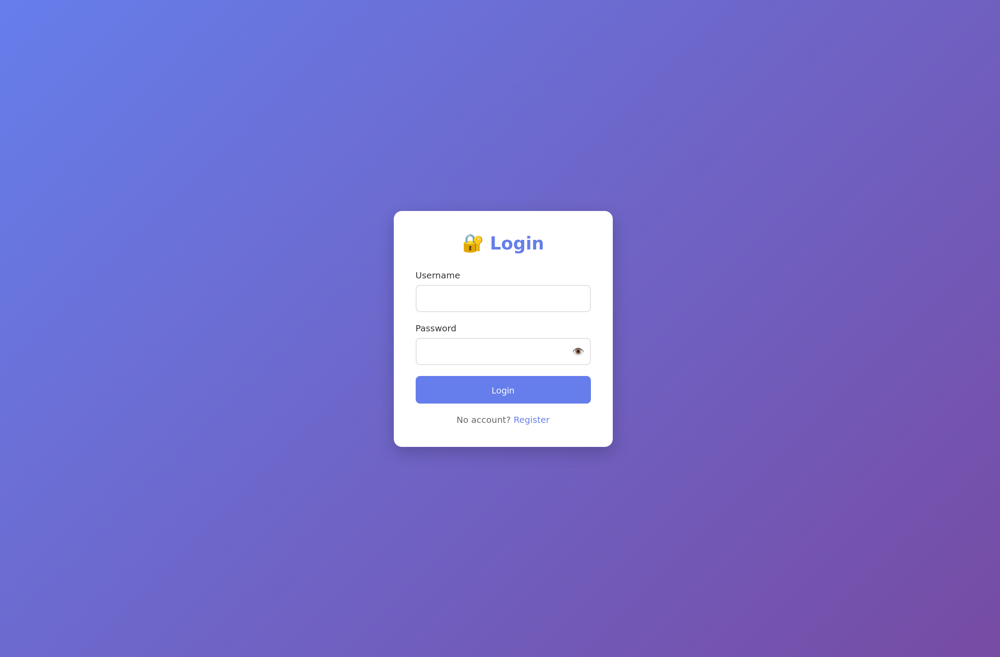
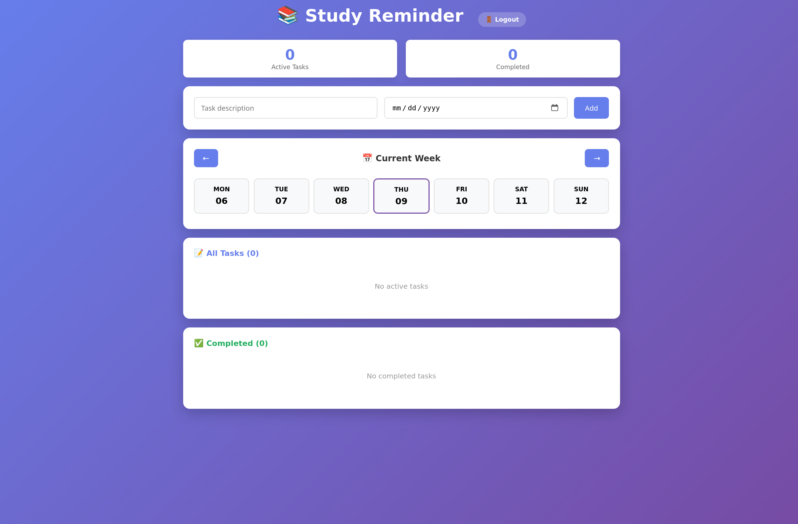

# Study Reminder

A web application that helps students manage their assignments and deadlines with a convenient weekly calendar view.

## Demo




## Product Context

### End Users
University and college students.

### Problem
Students often forget about deadlines and struggle to organize their academic tasks, especially when they have many assignments.

### Solution
A web application with personal accounts that provides convenient task storage, deadline tracking, and a weekly calendar view to help students visualize their workload and stay organized.

## Features

### Implemented Features
- ✅ User registration and authentication
- ✅ Add task with deadline
- ✅ Weekly calendar view with navigation
- ✅ Visual deadline indicators (color coding):
  - **Overdue** — past deadline
  - **Urgent** — 1 day or less remaining
  - **Soon** — 3 days or less remaining
  - **Normal** — more than 3 days remaining
- ✅ Mark task as completed
- ✅ Delete task
- ✅ View active and completed tasks separately

### Planned Features
- ⏳ AI-powered smart task prioritization
- ⏳ Task categorization by subject
- ⏳ Email notifications about deadlines
- ⏳ Automatic reminders
- ⏳ Task planning page

## Usage

### Run locally

```bash
pip install -r requirements.txt
python app.py
```

Open http://localhost:5000

### Run with Docker

```bash
docker-compose up -d
```

Open http://localhost:5000

## Deployment

### OS Requirements
- Ubuntu 24.04

### Prerequisites
- Docker and Docker Compose

### Step-by-step Deployment

1. Install Docker:
```bash
sudo apt update
sudo apt install docker.io docker-compose -y
```

2. Clone the project:
```bash
git clone <repository-url>
cd study-reminder-web
```

3. Build and run:
```bash
docker-compose up --build -d
```

4. Open in browser: `http://<<your_ip>>:5000`

## Technology Stack

- Python 3.11
- Flask 3.0
- SQLite
- Docker

## Project Structure

```
study-reminder-web/
├── app.py              # Main application code (Flask app, routes, database)
├── requirements.txt    # Python dependencies
├── tasks.db            # SQLite database (auto-created)
├── Dockerfile          # Docker configuration
├── docker-compose.yml  # Docker Compose configuration
├── templates/
│   ├── index.html      # Main page with weekly calendar view
│   ├── login.html      # Login page
│   ├── register.html   # Registration page
│   └── plan.html       # Planning page (planned)
├── demo/               # Screenshots for README
├── README.md           # Documentation
└── LICENSE             # MIT License
```

## License

MIT License - see LICENSE file
